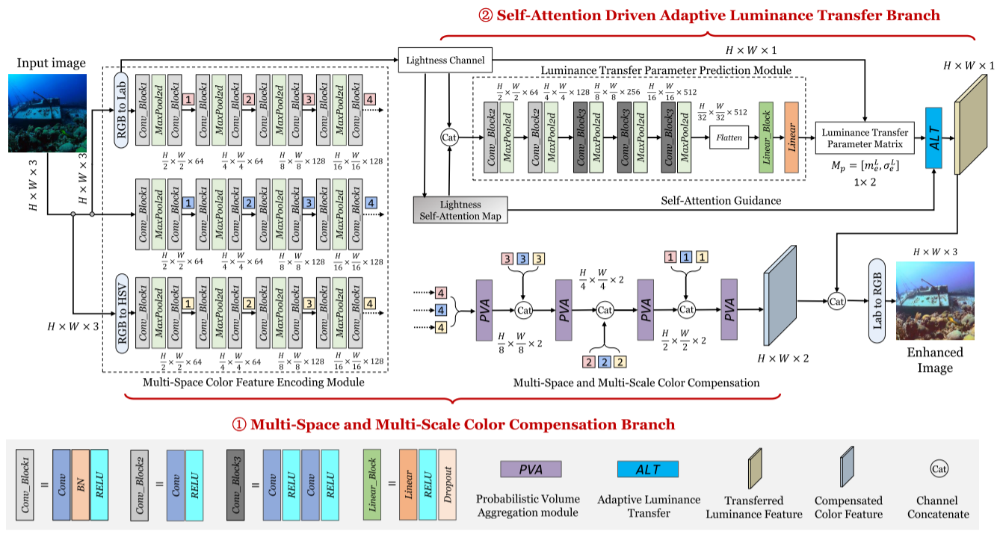

  
# MCAL-Net: Multi-Space Color Compensation and Adaptive Luminance Transfer Network for Underwater Images

Wenjie Liu, Zhou Ge*, Shaixin Liu, Kunqian Li and Dalei Song
 

    <h4 align="center">
        <a href="" target='_blank'>[Paper]</a>
        <a href="" target='_blank'>[Code]</a> 
    </h4>

## Abstract:
Vision serves as a crucial information source for
underwater observation and operations; however, the quality of
underwater imaging is often compromised by significant color
distortion and loss of details, which are further exacerbated
under non-uniform lighting conditions. The existing traditional
non-learning solutions often struggle to adapt to diverse under-
water degradation, while purely data-driven learning strategies
are often limited by scarce and low-quality samples, making it
difficult to achieve satisfactory results. In contrast to existing
joint learning frameworks, we propose a unified yet decoupled
framework for effectively addressing the challenges of color
correction and illumination enhancement in underwater images.
Our proposed method employs distinct prediction and learning
strategies to tackle these two key issues separately, thereby
overcoming the limitations associated with the reference of
learning samples that neglect lighting conditions. Consequently,
our approach yields enhanced overall visual effects for underwa-
ter image enhancement. Comparative experiments and ablation
experiments on publicly available datasets have validated the
effectiveness of the proposed self-attention-driven adaptive lumi-
nance transfer and multiple color space feature encoding.

</tr>
</table>

## Setup

- Pytorch >= 1.10.2
- opencv-python >= 4.7.0.72
- Other required packages in `requirements.txt`

## Testing steps
You can use our pre-trained models from: <a href="https://pan.baidu.com/s/11BH-JusDxpHPb7EIuGgDYQ?from=init&pwd=2p0n" target='_blank'>[model]</a>, and run the following commands:
 
    python test.py
The rusults are saved in ./results/

## When the paper is accepted, we release the relevant code.

